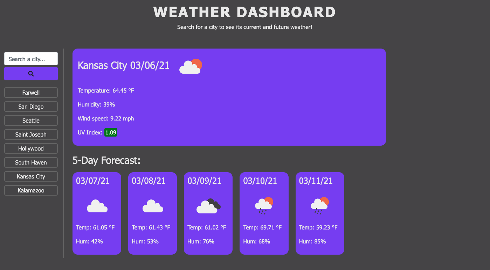
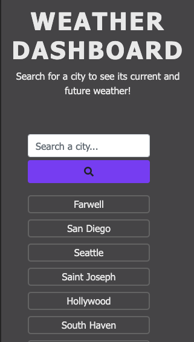

# weather-dashboard

## Weather Dashboard
This site allows users to search a city and see both current weather information and a five-day forecast. Once the user searches for a city, the city name is locally stored and rendered under the search bar. The user can click any of their previous searches and see weather information for that city.

## Future improvements
In the future, I'd like to improve the search experience such that a user is able to specify the state of the city they are looking for. At this point, the user is unable to choose between, for example, Lafayette in Indiana and Lafayette in Louisiana. This is pretty big limitation of the current application. 

At least one other feature I'd like to include is a button that allows a user to delete their previous searches from the page and local storage. I'd also like to include a button for each individual recent search that allows a user to delete just that item from the page and local storage. 

## Deployment 
To visit this website, simply follow this [link](https://rflctveq.github.io/weather-dashboard/) or enter the following into your address bar: https://rflctveq.github.io/weather-dashboard/. 

## Screenshots
Here's an image of the application being run on a desktop-sized viewport: 

And here's an image of the application being run on a viewport the size of an iPhone X:

